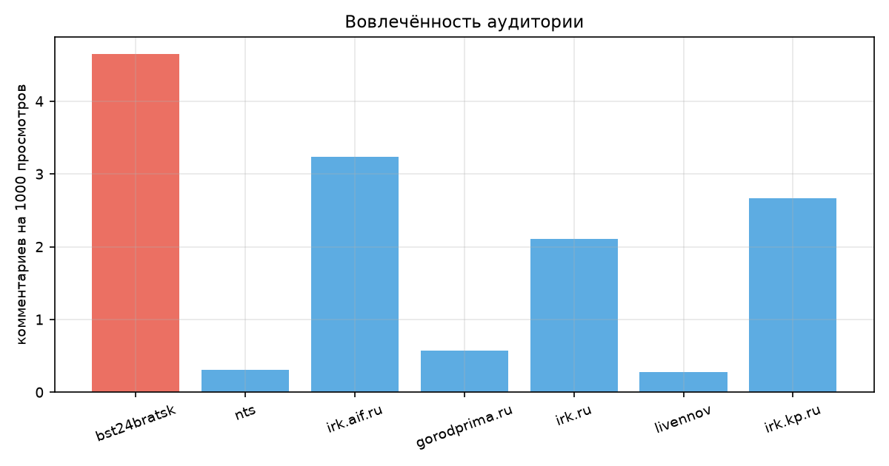
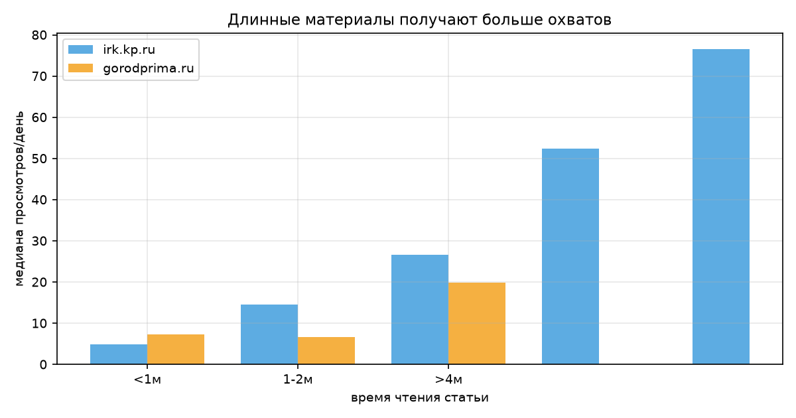
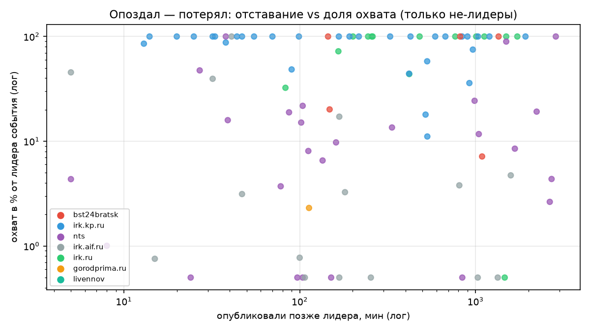
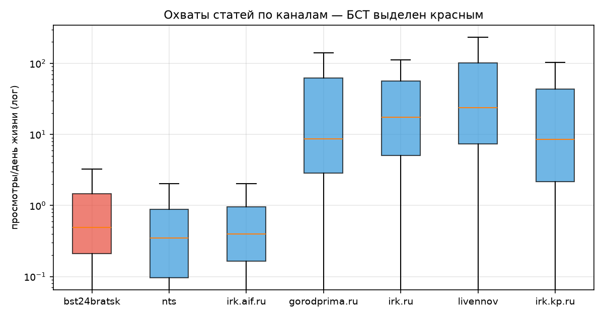
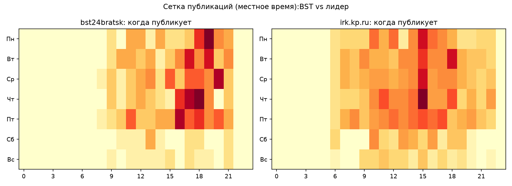
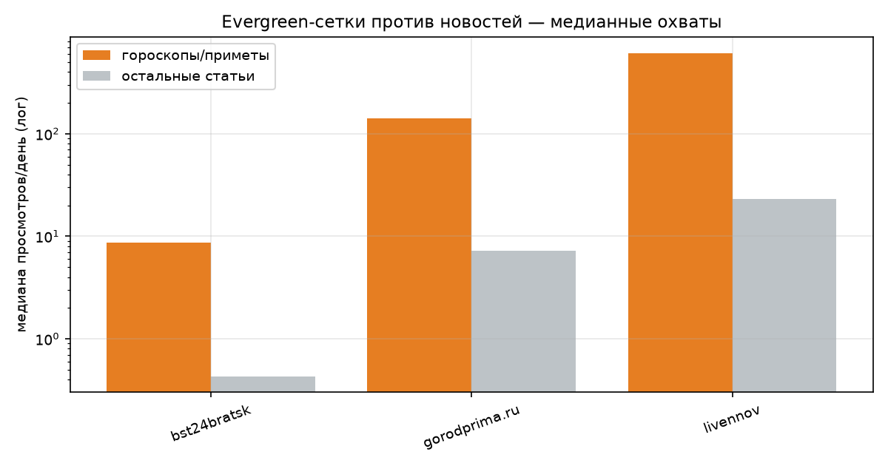

# Отчёт v2: конкурентный анализ и приоритеты роста bst24bratsk

**Дата:** 19.09.2026 · **Выборка:** 1 828 публикаций, 7 каналов, 21 день · **Фокус:** рост канала **bst24bratsk** (БСТ, Братск, 6 310 подписчиков)

**Что добавлено к отчёту v1:** комментарии и время чтения из API; лиды текстов; кластеризация 85 межканальных событий (одна новость → несколько каналов); пересбор данных свежим замером просмотров. Метрика vpd — просмотры за день жизни поста (публичное API не отдаёт показы/CTR).

---

## 1. Вовлечённость — скрытый козырь БСТ

| Канал | Комментариев на 1000 просмотров | Постов с комментариями |
|---|---:|---:|
| **bst24bratsk** | **4,65** | 15% |
| irk.aif.ru | 3,24 | 10% |
| irk.kp.ru | 2,67 | 26% |
| irk.ru | 2,11 | 17% |
| gorodprima.ru | 0,58 | 19% |
| nts | 0,31 | 10% |
| livennov | 0,28 | 24% |

У БСТ **самая «разговорная» аудитория рынка** — в 16 раз вовлечённее, чем у НТС, и в 2 раза, чем у КП. Пример: «В Братске застрелили ещё 4 медведей…» — 91 комментарий на 1000 просмотров, лучший показатель всей выборки. Проблема канала не в качестве аудитории, а в её объёме: алгоритм просто не показывает посты. Обсуждаемые темы у БСТ — медведи, ЖКХ, городская среда; комментарии стоит «затравлять» вопросом в конце поста.

## 2. Длина материалов: Дзен платит за глубину

Медианный vpd статей irk.kp.ru по времени чтения: **<1 мин — 4,9 → 1–2 мин — 14,5 → 2–3 мин — 26,6 → 3–4 мин — 52,4 → >4 мин — 76,6** (рост в 15 раз). У gorodprima.ru та же картика (>4 мин — 19,8 против 7,3 у коротких).

У БСТ 84% статей короче 2 минут — это формат «телеграфной строки», который алгоритм Дзена продвигает хуже всего (исторически платформа вознаграждает дочитывания). **Вывод: перевести часть потока из коротких новостей в материалы на 2–4+ минуты чтения** (разборы, «что известно о…», карточки с деталями). НТС с тем же «коротким» форматом имеет идентично мёртвую медиану (0,2–0,4 vpd) — это подтверждение, что дело в формате, а не только в канале.

## 3. Событийная конкуренция: скорость есть, охвата нет

Из 1 828 постов собрано **85 событий**, которые освещали ≥2 канала.

**Покрытие и скорость:**

| Канал | Участие в событиях | Медианное отставание | Был первым |
|---|---:|---:|---:|
| irk.kp.ru | 70/85 (82%) | 0 мин | 39 раз |
| nts | 39/85 (46%) | 78 мин | 13 раз |
| irk.aif.ru | 31/85 (36%) | 0 мин | 16 раз |
| irk.ru | 24/85 (28%) | 201 мин | 10 раз |
| **bst24bratsk** | **13/85 (15%)** | **0 мин** | **8 из 13** |
| gorodprima.ru | 1/85 (1%) | 113 мин | 0 раз |

Ключевой факт: **когда БСТ берёт событие, он публикует первым в 62% случаев** — скорость не проблема. Проблема — селекция: 85% общерегиональных событий канал пропускает (Братск-центризм). Даже «чужие» иркутские события с братским углом (медведи, ЖКХ, суды) — рабочее поле.

**Цена опоздания** (доля охвата от лидера события, все каналы): публикация с опозданием 0,5–2 часа оставляет медианные **32%** охвата лидера; позже 2 часов — 58–75% (выживают те, кто заходит под другим углом). Окно решающих 2 часов.

**Дуэли БСТ (13 событий, 6 побед):** БСТ выигрывает у НТС на совместных темах (×2,7–×8,7 — «Лесохранитель», электростанция, ДТП в Тайшете). Проигрыши концентрируются против irk.kp.ru / irk.ru и выглядят как «сухая строка против заголовка с деталью»:
- БСТ: «4 км дороги к селу Тангуй отремонтировали…» → 0% от охвата irk.ru
- БСТ: «Фейковая доставка цветов лишила семью 2 млн…» → 0% от охвата КП («Старшеклассница хотела получить цветы и конфеты, а отдала 2 миллиона»)

Проигрыш при нулевом отставании означает: **на одном событии заголовок конкурента собирает сотни просмотров, наш — единицы.** Это не скорость, а упаковка.

## 4. Сводный бенчмарк БСТ против рынка

| Разрез | bst24bratsk | Лучший на рынке | Разрыв |
|---|---|---|---|
| Медиана vpd статей | 0,5 | livennov 24 | ×48 |
| Плотность | 17,6/день | irk.kp.ru 30 | — |
| Доля статей >2 мин чтения | 16% | irk.kp.ru 62% | — |
| Покрытие событий региона | 15% | irk.kp.ru 82% | — |
| Скорость (медиана) | 0 мин | 0 мин (КП, АиФ) | паритет |
| Вовлечённость, комм/1000 | 4,65 | 4,65 (БСТ — лидер) | — |
| Evergreen | ×20 к своим новостям | ×19–27 у всех | паритет |
| Шортсы | нет | livennov ×95 к статьям | канал не работает |

## 5. Приоритетный план для bst24bratsk

По убыванию ожидаемого эффекта (каждый пункт привязан к данным выше):

1. **Формат: 2–3 «материала» в день на 2–4 минуты чтения** вместо части коротких новостей (раздел 2: у КП рост охвата ×5–15 на длинных формах; у БСТ 84% статей <2 мин). Остальные новости — сокращённым потоком.
2. **Заголовок по шаблону «эмоция/деталь: суть»** — устранить «телеграфные» строки, которые проигрывают дуэли при равной скорости (раздел 3). В проигранных дуэлях у конкурентов всегда есть человеческая деталь («старшеклассница хотела получить цветы»), у БСТ — метры и километры.
3. **Расширить селекцию событий за пределы Братска**: брать общерегиональные поводы с братским/углублённым углом (раздел 3: покрытие 15% при готовой скорости). Окно — 2 часа, позже имеет смысл выходить только с новым углом.
4. **Шортсы 3–5 в неделю** — единственный формат с тысячами просмотров на старте (у gorodprima ×35, у livennov ×95 к статьям). У БСТ есть видео-производство (52 лонга за 3 недели) — нарезать вертикальные версии.
5. **Evergreen-сетка уже работает (гороскопы ×20)** — сохранить, добавить «приметы» и «что нельзя делать» (у livennov этот формат — лучший, 5 400 vpd).
6. **Капитализировать вовлечённость (лидер рынка, 4,65)**: заканчивать посты вопросом, отвечать в комментариях в первый час — комментарии сигналит алгоритму и поднимает показы.
7. **Тайминг**: сдвинуть пик публикаций с вечера (18–21) на утро 06:00–11:00 и усилить пятницу/субботу (данные v1).

## 6. Ограничения

- Показы, CTR и дочитывания в публичном API недоступны — «длина» и «заголовок» частично смешаны с темой материала.
- 85 событий — только межканальные совпадения (братск-специфичные новости без конкурентов не попали в дуэли).
- Классификация тем/evergreen — ключевая эвристика; vpd линеаризует накопление просмотров.
- Выборка 3 недель сентября: сезон медведей/выборов/отопления искажает тематику.

## Артефакты

- `dzen_crawler.py` — сбор (каналы по имени и channel_id; поля views/comments/size_sec/lead)
- `events.py` — кластеризация событий (Жаккар ≥ 0,3, окно ±48 ч, 85 событий) → `data/events.csv`
- `analyze.py`, `analyze2.py` — расчёты v1/v2 · `charts.py` — графики в `charts/`
- Данные: `data/all_channels.csv` (1 828 строк), `data/<канал>_content.csv`
